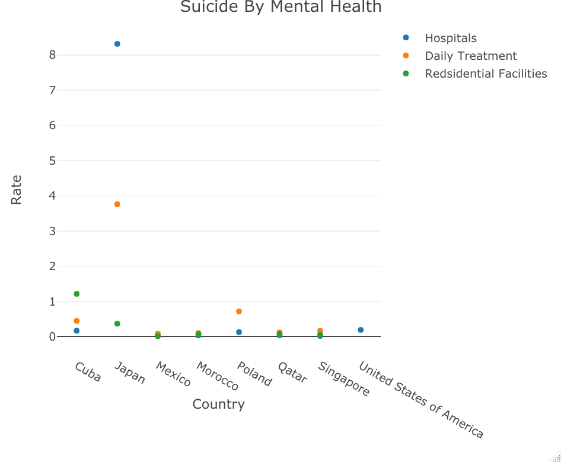
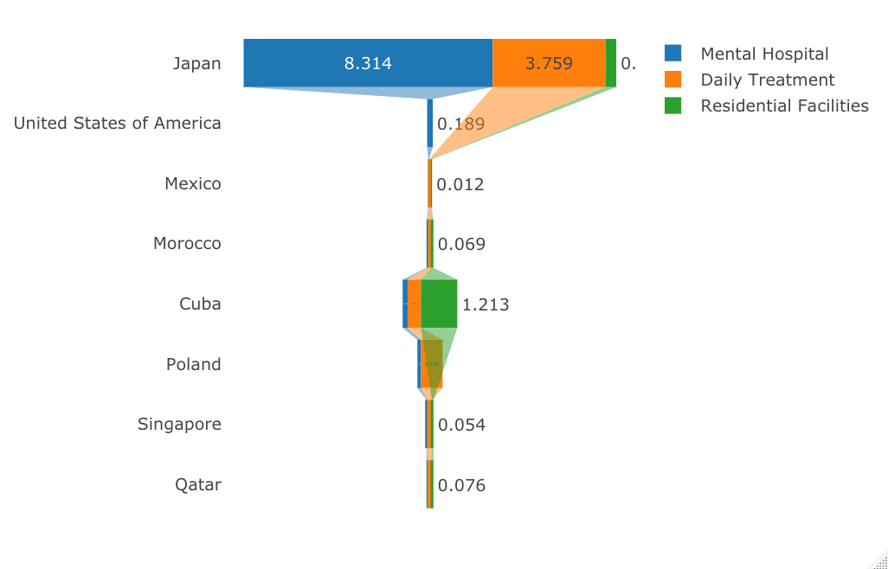
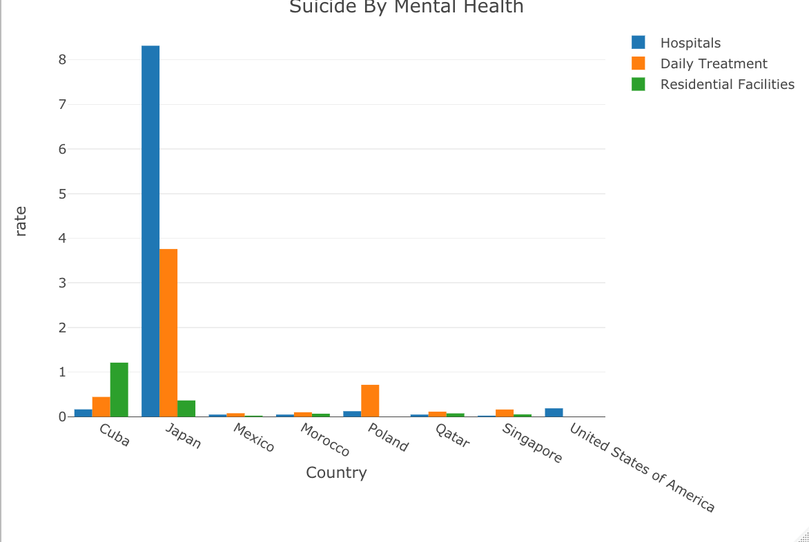

## Suicide Rate By Mental Health in different countries

### Introduction

Every day there are many people commit suicide across the world and lots of the time people commit suicide due to there mental health and other personal issues too. I genuinely worry about people's mental health, particularly during and after COVID-19. Many people may have overlooked the seriousness of this problem despite the lock down's obvious negative effects on people's mental and psychological actions and perceptions. And maybe by employing code analysis, we can determine how strongly the epidemic and suicide rates are related.

### Summary Paragraph

#### Facilities Data

The maximum and minimum values of Mental \_hospitals in the eight countries Japan, United States of America, Mexico, Morocco, Cuba, Poland, Singapore, and Qatar. The national difference is 8.296. The difference in health_units is 0.444, the difference in outpatient \_facilities is 7.097, the difference in day \_treatment is 3.68, and the difference in residential_facilities is 1.201.

#### Age Data

There are 4392 valid values in the age dataset, the maximum value is 106.4, the minimum value is 0.78, the mean is 15.23109, and the median is 11.59.

### Table of Summary

#### Age Table

-   The first table shows the suicide age rate per 100,000 population in different countries. The info was from the most recent dataset by WHO. From the dataset an pertinent observations that I found was how male suicide rate are higher then female by age.

```{r echo = FALSE, results = "asis"}
library(knitr)
data(table_sum_age.r)
kable(table_summary)
```

#### Facilities Table

-   The second table shows the different facilities that different countries has. Looking at the data I found that pertinent observations is how Japan has the most mental hospital compare to the other countries. Which I though United States should maybe would have more in comparison.

```{r echo = FALSE, results = "asis"}
library(knitr)
data(table_sum_facilities.r)
kable(table_sum_fac)
```

### Charts

#### Scatter Plot

The purpose of this scatter plot is to have a clear look at the facilities in each countries. The pertinent observations that I found was how comparing the 8 countries Japan has one of the top for mental hospital and one of the top for daily treatment which was kind of surprising to see how high it is.



#### Funnel Plot

The purpose of this chart is to see the relationship between Japan and the United States. Pertinent observation is how America in a different data has the highest suicide rate comparing to other.



#### Bar Chart

The purpose of this chart is for fast visual on the country of the highest suicide rate by facilities. By looking at it Japan is the countries with the most and how Cuba has the most residential facilities and Poland has the second most daily treatment



### Charts

#### Pie chart


This is a pie chart that shows these countries suicide rate. Pie chart gives out exact rate of the data, and from this chart I can see that Qatar has the least suicide rate among these countries.

#### Scatter plot


#This scatter chart represent the average suicide age among these countries. In this chart, I found out that US has the highest suicide rate among these countries. And Qatar has the lowest.

#### Bar chart


This bar chart also shows the suicide rate by age among these countries, the bar chart gives out a better understanding on the data. In this chart I found that the the average suicide age in the US is 40 years old.
